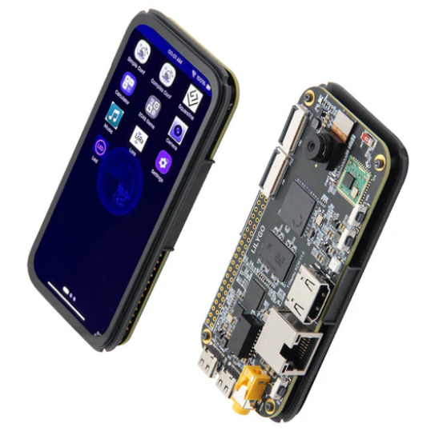

<!--

 * @Description: None
 * @version: V1.0.0
 * @Author: LILYGO
 * @Date: 2025-02-20 16:13:14
 * @LastEditors: Please set LastEditors
 * @LastEditTime: 2025-03-05 18:07:02
 * @License: GPL 3.0
-->
<h1 align = "center">T-Display-K230_canmv_rt</h1>

<p align="center" width="100%">
    
</p>


## **English**

## Version iteration:
| Version                              | Update date                       |Update description|
| :-------------------------------: | :-------------------------------: | :-------------------------------: |
| T-Display-K230_canmv_rt_V1.0     | 2025-02-20      |Original version      |
| T-Display-K230_canmv_rt_V1.1     | 2025-03-25       | update lora model（sx1262） |
|  |  |  |

## PurchaseLink

| Product                     | SOC           |  FLASH  |  LPDDR   | Link                   |
| :------------------------: | :-----------: |:-------: | :---------: | :------------------: |
| T-Display-K230_canmv_rt| k230 |   SD Card   | 1GiB | [LILYGO Mall](https://lilygo.cc/products/t-display-k230?_pos=2&_psq=k230&_ss=e&_v=1.0&variant=45197449953461)  |

## Directory
- [Describe](#describe)
- [Preview](#preview)
- [Module](#module)
- [QuickStart](#quickstart)
- [PinOverview](#pinoverview)
- [RelatedTests](#RelatedTests)
- [FAQ](#faq)
- [Project](#project)
- [Information](#information)
- [DependentLibraries](#dependentlibraries)

## Describe

T-Display-K230 is a development board featuring a high-definition AMOLED display, based on the k230, designed for standalone battery connectivity.

## Preview

### Actual Product Image

<p align="center" width="100%">
    
</p>


## Module

### 1.MCU

* Chip: k230
* For more details, please visit[k230 Datashee](datasheet/K230_datasheet.pdf)

### 2. Screen

* Size: 4.1-inch AMOLED  screen
* Resolution: 568x1232px
* Screen type: AMOLED
* Driver chip: RM69A10

### 3. Touch

* Chip: GT9895
* Bus communication protocol: IIC
<!--
### 4. Charging chip

* Chip: SY6970
* Bus communication protocol: IIC
* Other: The output waveform of the chip will be highly unstable when powered by a 5V supply without a battery connected. To stabilize the situation, it is necessary to either connect a battery or use software to disable the battery channel. By doing so, the instability will be alleviated.

### 5. RTC

* Chip: PCF8563
* Bus communication protocol: IIC
-->
## QuickStart

### Examples Support


| Firmware | Description | Picture |
| -------- | ----------- | ------- |
|          |             |         |


#### **k230**

# App Compilation

change to current dir canmv_k230


      cd anmv_k230/src/rtsmart/mpp
      source build.sh
      cd /userapps/sample/sample_display
      make

in the dir sample/elf     generate sample_display.elf

default app: sample_display


rename sample_display.elf to app.elf  copy to sdcard  ,Power on again and start running by default.

# Advanced - Custom Firmware

## 1. Overview

Note

This chapter introduces how to develop on the K230 CanMV. If you have no custom requirements, you can skip this chapter.

The K230 CanMV is developed based on the K230 SDK 

## 2. Setting Up the Development Environment

| Host Environment            | Description                                                  |
| --------------------------- | ------------------------------------------------------------ |
| Ubuntu 20.04.4 LTS (x86_64) | The K230 CanMV compilation environment is suitable for Ubuntu 20.04 and above. |

Currently, K230 CanMV has only been verified to compile in a Linux environment. Other Linux versions have not been tested, so compatibility with other systems cannot be guaranteed.

### 2.1 Local Build Environment

- Update APT sources (optional)

```
sudo bash -c 'cp /etc/apt/sources.list /etc/apt/sources_bak.list && \
  sed -i "s/archive.ubuntu.com/mirrors.tuna.tsinghua.edu.cn/g" /etc/apt/sources.list && \
  sed -i "s/security.ubuntu.com/mirrors.tuna.tsinghua.edu.cn/g" /etc/apt/sources.list'
```


- Install necessary dependencies

```
# Add support for i386 architecture
sudo bash -c 'dpkg --add-architecture i386 && \
  apt-get clean all && \
  apt-get update && \
  apt-get install -y --fix-broken --fix-missing --no-install-recommends \
    sudo vim wget curl git git-lfs openssh-client net-tools sed tzdata expect mtd-utils inetutils-ping locales \
    sed make cmake binutils build-essential diffutils gcc g++ bash patch gzip bzip2 perl tar cpio unzip rsync \
    file bc findutils dosfstools mtools bison flex autoconf automake python3 python3-pip python3-dev python-is-python3 \
    lib32z1 scons libncurses5-dev kmod fakeroot pigz tree doxygen gawk pkg-config libyaml-dev libconfuse2 libconfuse-dev \
    libssl-dev libc6-dev-i386 libncurses5:i386'
```


- Update PIP sources (optional)

```
pip3 config set global.index-url https://pypi.tuna.tsinghua.edu.cn/simple && \
pip3 config set global.extra-index-url "https://mirrors.aliyun.com/pypi/simple https://mirrors.cloud.tencent.com/pypi/simple"
```


- Install Python dependencies

```
pip3 install -U pyyaml pycryptodome gmssl jsonschema jinja2
```


- Install the repo tool

```
mkdir -p ~/.bin
curl https://storage.googleapis.com/git-repo-downloads/repo > ~/.bin/repo
chmod a+rx ~/.bin/repo
echo 'export PATH="${HOME}/.bin:${PATH}"' >> ~/.bashrc
source ~/.bashrc
```


## 3. Compilation Process

### 3.1 Source Code Download

The source code of CanMV-K230 is hosted on Github. Users can download the source code using the repo tool.

```
# It's recommended to create a directory in the user's home directory before downloading the code
mkdir -p ~/canmv_k230_pro && cd ~/canmv_k230_pro

# Download the RT-Smart + CanMV project
git clone https://github.com/Xinyuan-LilyGO/T-Display-K230_canmv_rt.git
```


### 3.2 Code Preparation

When compiling for the first time, you need to download the toolchain. The following command only needs to be executed once.

```
cd canmv_k230
# Download the toolchain when running for the first time
make dl_toolchain
```


### 3.3 Compilation

Select the corresponding board configuration file according to actual needs, and then start compiling.

```
# List available configuration options
make list_def 
# Select the corresponding board configuration file
make k230_canmv_defconfig  # Replace with the appropriate defconfig for your board
# Start compilation
time make log
```


After compilation, the image files will be generated in the `canmv_k230_pro/canmv_k230/output/xxxx/xxx.img` directory.


```

```

### firmware download

### 1. Flashing on Windows Platform

On a Windows system, you can use the Rufus tool to flash the firmware to a TF card. The download address for Rufus is: [Rufus Official Website](http://rufus.ie/downloads/).

1. Insert the TF card into your computer and start the Rufus tool. Click the “Select” button in the interface and choose the firmware file to be flashed. 
2. Click the “Start” button, and Rufus will automatically proceed with the flashing. The progress bar will display the flashing progress, and the system will prompt “Ready” upon completion.    

### 2 Flashing on Linux Platform

Before inserting the TF card, first run the following command to check the current storage devices:

```
ls -l /dev/sd\*
```


Next, insert the TF card into the host machine and run the same command again to identify the newly added device node, which is the device node for the TF card.

Assuming the device node for the TF card is `/dev/sdc`, you can use the following command to flash the firmware to the TF card:

```
sudo dd if=sysimage-sdcard.img of=/dev/sdc bs=1M oflag=sync
```

## PinOverview

| AMOLED Screen Pin  | k230 Pin|
| :------------------: | :------------------:|
| LCD_RST   | GPIO22  |

| Touch Chip Pin  | k230 Pin |
| :------------------: | :------------------:|
| TP_RST   | GPIO24 |
| TP_SCL | GPIO36 |
| TP_SDA | GPIO37 |
| TP_INT | GPIO23 |

| HDMI Pin | k230 Pin |
| :------------------: | :------------------:|
| HDMI_RSTN | GPIO24  |
| HDMI_INT | GPIO22 |
| HDMI_CSCL | GPIO36 |
| HDMI_CSDA | GPIO37 |

| SD Card Pin  | k230 Pin |
| :------------------: | :------------------:|
| TFCARD_CMD  |  GPIO54  |
| TFCARD_CLK  |  GPIO55  |
|  TFCARD_D0  |  GPIO56  |
|  TFCARD_D1  |  GPIO57  |
|  TFCARD_D2  |  GPIO58  |
|  TFCARD_D3  |  GPIO59  |

## RelatedTests

### <!--Power Dissipation
| Firmware | Program| Description | Picture |
| ------  | ------  | ------ | ------ |
| `[T-Display-S3-AMOLED-1.43_V1.0][Light_Sleep_Wake_Up]_firmware_V1.0.0.bin` | `Light Sleep Wake Up` | Power dissipation: 1282.8uA | <p align="center" width="10%">  </p> |
| `[T-Display-S3-AMOLED-1.43_V1.0][Deep_Sleep_Wake_Up]_firmware_V1.0.0.bin` | `Deep Sleep Wake Up` | Power dissipation: 174.2uA |<p align="center" width="10%">  </p> |

-->

## FAQ

* Q. After reading the above tutorials, I still don't know how to build a programming environment. What should I do?
* A. If you still don't understand how to build an environment after reading the above tutorials, you can refer to the [LilyGo-Document](https://github.com/Xinyuan-LilyGO/LilyGo-Document) document instructions to build it.

## Project
* [T-Display K230 V1.0.pdf](./schematic/T-Display K230 V1.0.pdf)

## Information
* [sx1262](./datasheet/HPDTEK_HPD16A_Series_规格书_V0.3.pdf)

  

## DependentLibraries
* [lvgl-8.3.5](https://lvgl.io)

